Our overarching goal in this workshop is to learn how to use AI coding tools to
make your **research code more rigorous**. 

This is a fast-moving topic. We don’t claim to know everything. Some learners
may have more experience with AI-assisted coding than some instructors. We have
attempted to organize settled best practices in this area to the extent that
they exist, as we understand them.

## AI Tools for Research

There are many ways you might use generative AI tools (i.e., LLMs) in research.
Probably the simplest and most common approach is to use an AI "chat" interface
to answer basic questions. For more complex scenarios like data analysis, you
might be tempted to upload your research data to an AI chat system and start
asking questions about it -- to prompt your way through your analysis. This is a
bad idea for several reasons.  First, the results would be unreliable, they
might include "hallucinations", and you might be unintentionally sharing
sensitive data with third parties (model providers may use your data to train
future models). **Your analysis also would not be reproducible**, a cornerstone
of modern, computational open science. The approach we will emphasize in this
workshop is to use AI tools to generate code rather than the analysis
itself. This approach takes advantage of AI's strengths without (necessarily)
sacrificing in terms of scientific rigor.

::: {#fig-flowcharts layout="[2,3]"}

{fig-alt="Flowchart showing using LLMs to answer questions directly"}

{fig-alt="Flowchart showing using LLMs to generate code to answer questions"}

Instead of using LLMs to answer questions directly, use them to generate the
code needed to answer the question.

:::

AI chat interfaces are sufficient for small, one-off code generation tasks.
However, for complex work involving multiple rounds of iteration, it can be
tiresome to repeatedly move back and forth, pasting code snippets into your
editor and error messages into the chat window. For cases like these, it's
better to use a coding agent, which manages the interaction between your code
and the LLM.

{fig-alt="Diagram of coding agent mediating interaction" width=50%}

## What is a coding agent?

If you want an AI tool that *does* something (not just says something), then you
need an **agent**. What separates chat-based applications from agents is the
ability to use **tools** to interact with their environment. An agent is a
program that makes requests to an LLM model provider, just like typing messages
into a "chat" interface, except it *acts* on the response by invoking the tools
the agent has access to. Coding agents include tools for doing things like:
reading and writing files, running bash commands, and searching the file system.

**What is a tool?** You can think of a tool as some functionality that the agent
can perform, like "write to file". The agent includes a list of tool
descriptions in its requests to the LLM; in turn, the LLM may respond by
*invoking* a tool, supplying the inputs the tool needs to run. The agent is
responsible for actually running the tool with the input from the LLM, and
returning any output back to the LLM. 

**What is an LLM model provider?** You don't need to run LLMs on your own
machine to use them. Instead, you access them over the internet through
web-based APIs (like OpenAI's chat completions). A model provider is a web
service that lets you make requests to one or more LLMs using one of these
protocols.

