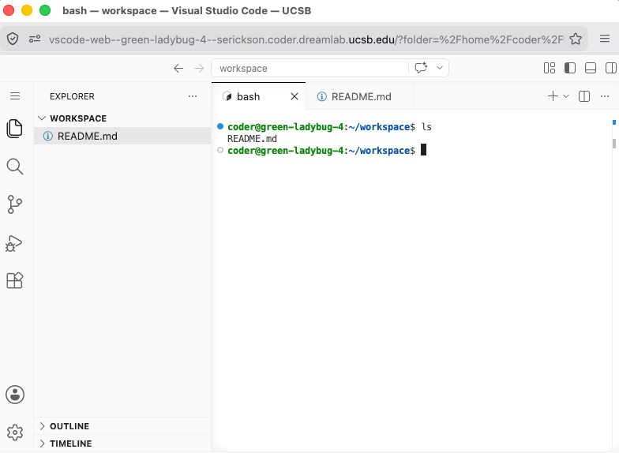
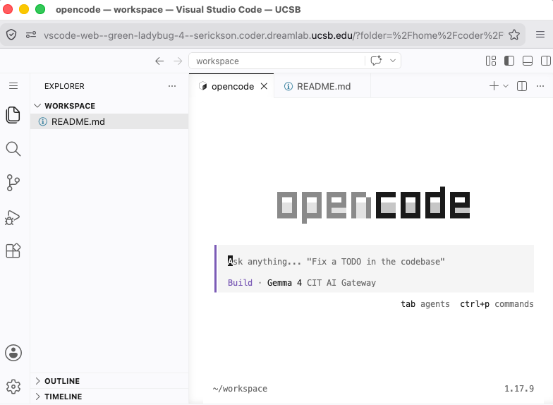

Coding agents are powerful tools, but they come with significant risks.  To use
agents safely, it’s important to run them in an environment where the potential
harms are mitigated. Coder Workspaces are very helpful for this purpose because
they are disposable virtual machines. Any agent running in a workspace can only
interact with the files you upload to the VM. This provides more safety than
running the agent on your personal computer, for example. 


## The Coder Workspace Environment

::: {.callout-note}
Coder workspaces are a UCSB-specific resource, however you could substitute
any cloud-based service for running virtual machines.
:::

Follow the [setup instructions](../setup.qmd) if necessary, to create a [Coder Workspace](https://coder.dreamlab.ucsb.edu). You should have a workspace with a dashboard like the image below.

{fig-alt="Example Coder Workspace dashboard with buttons to stop and restart the workspace, and open VS Code"}

Start VS Code from the workspace dashboard. The web-based editor starts in an empty directory (`~/workspace`). 

Explore the VS Code interface:

- Create a new file, called `README.md` 
- Open a terminal window

{fig-alt="VS Code Web interface with terminal window show output from `ls` command."}

### Git Setup

We will need to configure git in order to create commits later on.

```bash
git config --global user.name "Your Name"
git config --global user.email "you@ucsb.edu"

```

## Our Coding Agent: OpenCode

There are many coding agents out there. We like opencode because it was one of
the few widely used coding agents that is model agnostic. 

To start OpenCode, run `opencode` in the VS Code terminal.

{fig-alt="VS Code Web with OpenCode running."}

By default, OpenCode on Coder Workspaces is configured to use open weights
models through the College IT Gateway.

OpenCode needs to know which AI model to talk to. We'll point it at the **DREAM
Lab AI Gateway**, which gives us access to a range of models through a single API
key.

**1. Connect to a model provider.** In the OpenCode prompt, type `/connect` and
press <kbd>Enter</kbd>. Start typing `dream` to filter the list, then select
**DREAM Lab AI Gateway** under *Providers*.

{fig-alt="OpenCode model selection dropdown with DREAM Lab AI Gateway highlighted"}

**2. Enter your API key.** Paste the API key you were given for the workshop and
press <kbd>Enter</kbd> to submit.

{fig-alt="OpenCode prompt entering an API key"}

**3. Select a model.** Choose **Gemini 3.5 Flash** from the list of available
models. You can use (Ctrl+F) to "favorite" a model. We will use both Gemini 3.5
Flash and Gemini 3.1 Pro Preview (Custom Tools) -- you might want to favorite
both of these to make switching models a little easier.

{fig-alt="OpenCode model selection dropdown with Gemini 3.5 Flash highlighted"}

OpenCode is now configured and ready to use the DREAM Lab AI Gateway.

## Our First Prompt

To demonstrate the capabilities of a coding agent, let's ask OpenCode to inspect
that machine we're using.

```md
Tell me about the machine you're running on: OS, resources, etc.
```

OpenCode will probably ask you for permission to run a bash command to
inspect the machine. It's safe to say yes because this isn't your real machine!

The response should look something like this.

```md
I will run a few non-modifying commands to retrieve information 
about the operating system, CPU, memory, and disk resources.

bash tool: "uname -a && cat /etc/os-release && free -h && nproc && df -h /"

This machine is running:
- **OS**: Ubuntu 26.04 LTS (Kernel 7.0.0, x86_64)
- **CPU**: 4 Cores
- **RAM**: 15 GiB (12 GiB available)
- **Disk**: 14 GiB total, 8.1 GiB free (41% used)
```

## Agent Permissions

Most coding agents, including OpenCode, have a **permission system** used to
control what actions the agent is allowed to perform in its environment. In the
example above, OpenCode paused and asked before running a bash command. Even
though our agent is isolated in a throwaway virtual machine, it's worth
understanding how it decides when to ask for your approval.

The actions the agent can perform (e.g., reading files, editing them, running shell
commands, fetching URLs) are determined by permission levels:

- **`allow`** — the action runs automatically, no questions asked.
- **`ask`** — the agent pauses and waits for your approval.
- **`deny`** — the action is blocked entirely.

By default **OpenCode allows most actions**, but you can change this through
OpenCode's configuration file.

A few defaults worth knowing:

- Reading files outside the working directory defaults to `ask`.
- `.env` files are denied by default, so secrets aren't read accidentally.

## OpenCode Commands

You can type "`/`" followed by a command name to configure OpenCode or perform various actions. You can find a complete list of commands in the [OpenCode documentation](https://opencode.ai/docs/tui/#commands). 

The commands we will use in the workshop are listed here:

- `/connect` - Add a model provider. Allows you to select from available providers and add their API keys.
- `/exit` - Exit OpenCode. (You can also use `/q`)
- `/help` - Display help information 
- `/models` - List and switch between models
- `/new` - Start a new session (fresh context)
