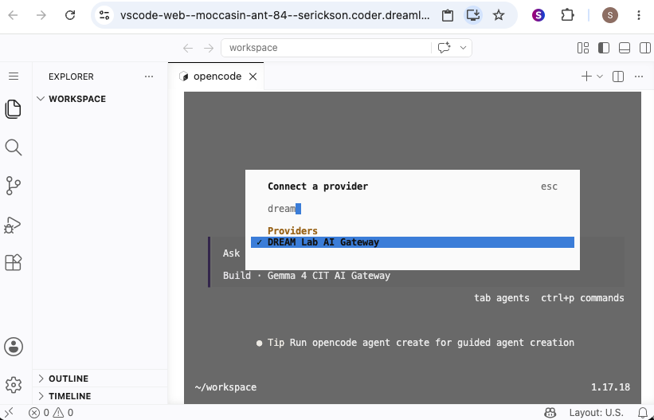
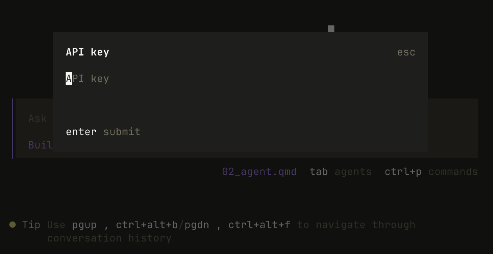
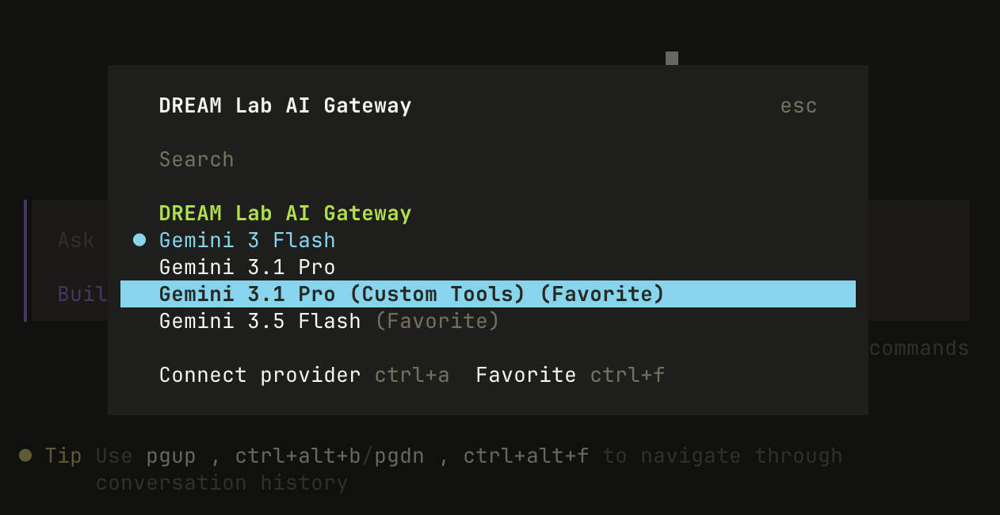

AI-assisted coding agents are powerful tools, but there are very real risks
associated with using them. To mitigate these risks, it's important to isolate
coding agents and limit the potential damage they could cause in the worst-case
scenario. For this workshop, we will use dedicated virtual machines (Coder
Workspace) to run our agents. This means the coding agent will only have access
to the files that we upload to the virtual machine.

## The Coder Workspace Environment

::: {.callout-note}
Coder workspaces are a UCSB-specific resource, however you could substitute
any cloud-based service for running virtual machines.
:::

Follow the [setup instructions](../setup.qmd) if necessary, to create a Coder Workspace. 

We will: 

- Connect to the workspace using VS Code Web
- The editor starts in an empty directory (`~/workspace`)
- We can upload and download files through VS Code or through the file browser.
- Create a terminal window in VS code and start opencode

## Our Coding Agent: OpenCode

There are many coding agents out there. We like opencode because it was one of
the few widely used coding agents that is model agnostic. 

OpenCode needs to know which AI model to talk to. We'll point it at the **DREAM
Lab AI Gateway**, which gives us access to a range of models through a single API
key.

**1. Connect to a model provider.** In the OpenCode prompt, type `/connect` and
press <kbd>Enter</kbd>. Start typing `dream` to filter the list, then select
**DREAM Lab AI Gateway** under *Providers*.

{fig-alt="OpenCode model selection dropdown with DREAM Lab AI Gateway highlighted"}

**2. Enter your API key.** Paste the API key you were given for the workshop and
press <kbd>Enter</kbd> to submit.

{fig-alt="OpenCode prompt entering an API key"}

**3. Select a model.** Choose **Gemini 3.5 Flash** from the list of available
models. You can use (Ctrl+F) to "favorite" a model. We will use both Gemini 3.5
Flash and Gemini 3.1 Pro Preview (Custom Tools) -- you might want to favorite
both of these to make switching models a little easier.

{fig-alt="OpenCode model selection dropdown with Gemini 3.5 Flash highlighted"}

OpenCode is now configured and ready to use the DREAM Lab AI Gateway.

## Our First Prompt

To demonstrate the capabilities of a coding agent, let's ask OpenCode to inspect
that machine we're using.

```md
Tell me about the machine you're running on: OS, resources, etc.
```

OpenCode will probably ask you for permission to run a bash command to
inspect the machine. It's safe to say yes because this isn't your real machine!

The response should look something like this.

```md
I will run a few non-modifying commands to retrieve information 
about the operating system, CPU, memory, and disk resources.

bash tool: "uname -a && cat /etc/os-release && free -h && nproc && df -h /"

This machine is running:
- **OS**: Ubuntu 26.04 LTS (Kernel 7.0.0, x86_64)
- **CPU**: 4 Cores
- **RAM**: 15 GiB (12 GiB available)
- **Disk**: 14 GiB total, 8.1 GiB free (41% used)
```

### Agent Permissions

Most coding agents, including OpenCode, have a **permission system** used to
control what actions the agent is allowed to perform in its environment. In the
example above, OpenCode paused and asked before running a bash command. Even
though our agent is isolated in a throwaway virtual machine, it's worth
understanding how it decides when to ask for your approval.

The actions the agent can perform (e.g., reading files, editing them, running shell
commands, fetching URLs) are determined by permission levels:

- **`allow`** — the action runs automatically, no questions asked.
- **`ask`** — the agent pauses and waits for your approval.
- **`deny`** — the action is blocked entirely.

By default **OpenCode allows most actions**, but you can change this through
OpenCode's configuration file.

A few defaults worth knowing:

- Reading files outside the working directory defaults to `ask`.
- `.env` files are denied by default, so secrets aren't read accidentally.

