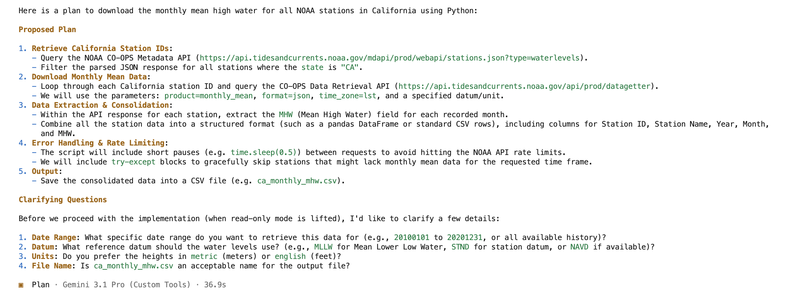
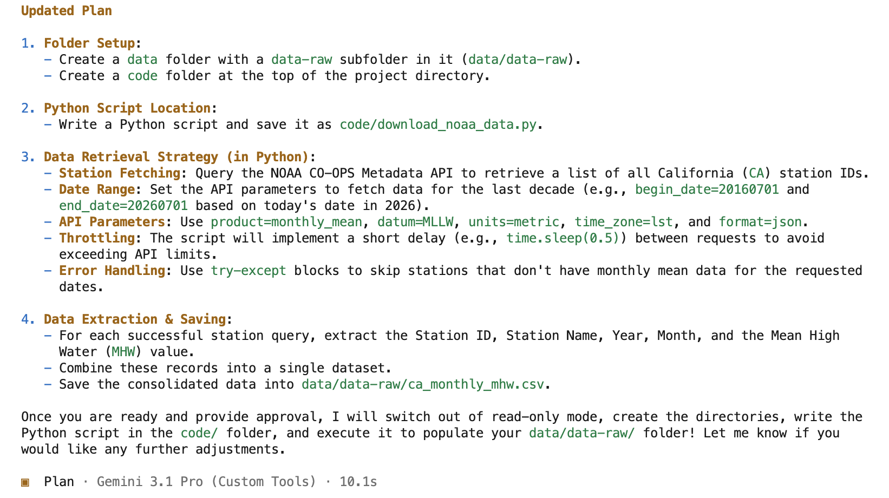

What we just did in the previous section, letting the agent have full control of a multi-step process, is not the best way to fully leverage Agentic coding capabilities. Instead, it is recommended to break down your workflow into smaller, distinct increments that are easier to verify and iterate on.

## Plan mode overview

This is precisely where "Plan mode" becomes invaluable. Plan mode allows you to refine your instructions for your agent, resolve potential ambiguities, and quickly redirect overeager agents. This gives you better control over the different components of your analytical workflow before any code or files are modified in your project. 

To effectively integrate Agentic AI into your work, consider following this structured approach:

- Begin in Plan mode (read-only)
- Review the proposed steps for your analysis 
- Supply additional context and refine the plan
- Iterate through this cycle as many times as needed
- Ask for separate scripts for the primary components of your workflow
- Once satisfied, switch to Build mode for actual implementation
- Utilize `/undo` and `/redo` commands to fine-tune the implementation details
- leverage version control to create snapshots of your work before and after major changes

## Initial project setup

Before you jumped into opencode, you want to take the time to setup your project

1. Create a project specific directory and make sure to start opencode from it
1. Initialize `git` to track changes
1. Write a concise `README.md` with information about the project
1. Create sub-directories for data, code, documents and other outputs

**All the information you are adding in this project directory will be included in the context that will be send to the model with your prompts, so it is beneficial to add as much information as you have at this point of your project.**

::: {.callout-note}
Opencode can assist you with these various steps. However, for project management and security reasons, it is recommended to launch opencode from a project-specific directory, as it requires by default explicit permission to access any files outside of that directory.
:::

## Switching to plan mode

In opencode, to switch from the "build" mode (default when you start opencode) to the "plan" mode you can use the <kbd>tab</kbd> key (`/plan` is also an option).

::: {.callout-note}
## Model Choice

For complex, multi-step problem planning, it is advisable to leverage the most advanced model available, keeping token costs in mind. After the initial steps are laid out, transitioning to a less advanced model to execute those predefined tasks can lead to a more efficient use of your resources.
:::

## Planning our NOAA tides example

Let's restart our NOAA tides example, this time leveraging Plan mode.

### Example

Here is a prompt example: 

> I would like to download the monthly mean high water for all NOAA stations in California using the NOAA API and python.

{fig-alt="Plan mode prompt answer showing the various proposed steps and supplemtal infomration requests"}

> Download data for the last decade, use the MLLW datum as reference, use the metric system for units, create a data folder with a subfolder data-raw in it and save the downloaded data in this subfolder. Write a Python script to downlaod the data and save it in a code folder at the top of our project folder

{fig-alt="Plan mode prompt answer update to incorporate the new information"}

_and repeat until you are satisfy!_

:::{.callout-tip}
## Challenge

Your turn!

As before complete the exercise individually but discuss results in small groups (2-5 people).

#### Our ask

1. Before you start prompting, think about the various steps you need
1. Refine the best your can the latest prompt you used previously
1. make sure you selected the `Gemini 3.1 Pro` model
1. Switch to Plan mode
1. Enter your prompts
1. Provide the requested information
1. Iterate until you are satisfied

:::

