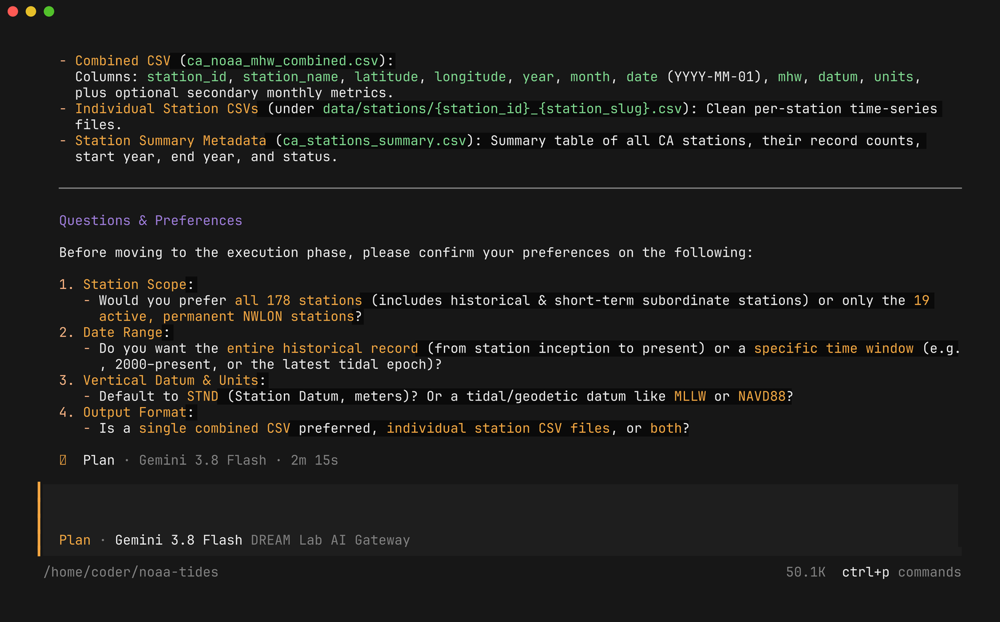
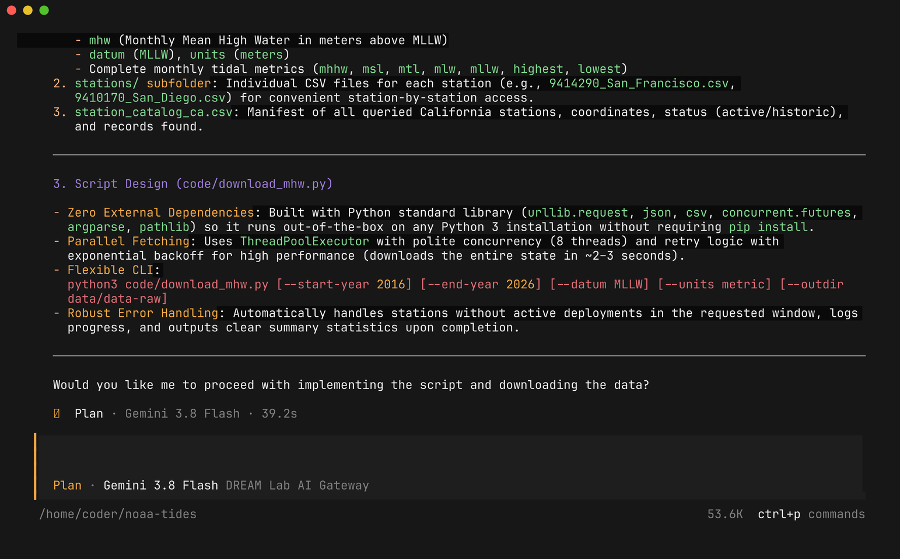

What we just did in the previous section, letting the agent have full control of
a multi-step process, is not the best way to fully leverage agentic coding
capabilities. Instead, it is recommended to break down your workflow into
smaller, distinct increments that are easier to verify and iterate on.


## Plan mode overview

This is precisely where "Plan mode" becomes invaluable. Plan mode allows you to
refine your instructions for your agent, resolve potential ambiguities, and
quickly redirect overeager agents. This gives you better control over the
different components of your analytical workflow before any code or files are
modified in your project.

To effectively integrate agentic AI into your work, consider following this
structured approach:

- Begin in Plan mode (read-only)
- Review the proposed steps for your analysis
- Supply additional context and refine the plan
- Iterate through this cycle as many times as needed
- Ask for separate scripts for the primary components of your workflow
- Once satisfied, switch to Build mode for actual implementation
- Leverage version control to create snapshots of your work before and after major changes

When reviewing the plan, you might consider questions such as:

- Does the plan **reveal gaps in your understanding** that need to be resolved
  before moving ahead? If you read the plan and think to yourself, "Wow, this is
  more complicated than I imagined!", then this might be the case. You might
  want to cancel the plan or rethink your approach.
- Does the plan **resolve ambiguities** in the initial prompt in ways that align
  with your expectations? If not, update the plan with additional specificity.
- Does the plan make **appropriate implementation choices** (programming
  language, dependencies, data sources, etc.)? You may need to *steer* the coding
  agent toward tools and approaches you prefer.

## Switching to plan mode

In OpenCode, you can use the <kbd>tab</kbd> key to switch between Plan and Build
modes. Build mode is the default when you start OpenCode. The active mode
appears right below the cursor in the prompt input area.

For complex, multi-step problem planning, it is advisable to leverage the most
advanced model available, keeping token costs in mind. After the initial steps
are laid out, transitioning to a less advanced model to execute those predefined
tasks can lead to a more efficient use of your resources.

:::{.callout-tip}

### Models for Planning

After toggling between modes, **always check which model you are using**, as
Plan and Build modes can use different models. You can sometimes save
money/tokens by planning with a larger, more expensive model and then
implementing with a smaller model. For the purposes of this workshop, we will
use **Gemini 3.8 Flash** for both planning and code generation.

:::

## Planning our NOAA tides example

Let's revisit the California tides analysis from the previous lesson and see
what it would be like to generate this code using planning mode. (Since you
already generated this code, **you don't need to follow the steps** here. This
is just a demonstration of Plan mode).

To use Plan mode:

1. Start OpenCode in the `noaa-tides` project folder. If you have an
   existing OpenCode session, start a new OpenCode session with `/new`.
2. Switch to Plan mode by pressing the <kbd>tab</kbd> key until you see "Plan"
   below the text input cursor.
3. Select your planning model with the `/models` command and choose the **Gemini
   3.8 Flash** model.

To kick off the planning process, enter your initial prompt:

> I would like to download the monthly mean high water for all NOAA stations in California using the NOAA API and python.

````markdown
Here is the plan for downloading Monthly Mean High Water (MHW) data for NOAA stations in California using the NOAA CO-OPS API and Python.

---

### Key API Findings & Technical Grounding

1. **Station Discovery (Metadata API)**:
   - **Active stations (`type=waterlevels`)**: **19 stations** in California (e.g., San Francisco, San Diego, Los Angeles, Monterey). These are long-term, continuous NWLON stations with decades of records (e.g., San Francisco has records dating back to 1854).
   - **All water level stations (`type=historicwl`)**: **178 stations** in California, including historical and short-term subordinate tide gauges (some spanning 1–12 months, others multiple years).
   - Endpoint: `https://api.tidesandcurrents.noaa.gov/mdapi/prod/webapi/stations.json?type={historicwl|waterlevels}`

2. **Data Retrieval API (`datagetter`)**:
   - Product: `product=monthly_mean`
   - Data fields returned: `year`, `month`, `MHW` (Mean High Water), along with `MHHW`, `MSL`, `MTL`, `MLW`, `MLLW`, `highest`, `lowest`.
   - Endpoint:
     ```
     https://api.tidesandcurrents.noaa.gov/api/prod/datagetter?station={station_id}&begin_date={begin}&end_date={end}&product=monthly_mean&datum={datum}&units={units}&time_zone=GMT&format=json
     ```
   - Performance: The API supports retrieving the entire historical record per station in a single request. Using multithreading (`ThreadPoolExecutor`), all 178 stations can be fetched in under 10 seconds.

---

### Proposed Implementation Plan

#### 1. Python Architecture & Dependencies
- Implement a modular, production-ready CLI script (e.g., `download_noaa_mhw.py`).
- **Dependencies**: Built on Python's standard library (`urllib.request`, `json`, `csv`, `concurrent.futures`, `argparse`), making it completely zero-dependency and runnable immediately with standard `python3` or `uv run`. Optional integration with `pandas` if data analysis is desired.

#### 2. Key Features & CLI Options
- `--scope`: Choice between `active` (19 NWLON stations) or `all` (178 historical + active stations, default).
- `--datum`: Default to `STND` (Station Datum — supported universally across all stations), with options for `MLLW`, `NAVD`, or `MSL`.
- `--units`: Default to `metric` (meters), with option for `english` (feet).
- `--start-date` & `--end-date`: Default to retrieving all available historical data (e.g., 1850 to present), with customizable date ranges (format `YYYYMMDD`).
- `--workers`: Configurable concurrent worker threads (default `8`–`10`) with retry handling and exponential backoff.
- `--output-dir`: Destination folder for output files.

#### 3. Output Data Structure
- **Combined CSV** (`ca_noaa_mhw_combined.csv`):
  Columns: `station_id`, `station_name`, `latitude`, `longitude`, `year`, `month`, `date` (YYYY-MM-01), `mhw`, `datum`, `units`, plus optional secondary monthly metrics.
- **Individual Station CSVs** (under `data/stations/{station_id}_{station_slug}.csv`): Clean per-station time-series files.
- **Station Summary Metadata** (`ca_stations_summary.csv`): Summary table of all CA stations, their record counts, start year, end year, and status.

---

### Questions & Preferences

Before moving to the execution phase, please confirm your preferences on the following:

1. **Station Scope**:
   - Would you prefer **all 178 stations** (includes historical & short-term subordinate stations) or only the **19 active, permanent NWLON stations**?
2. **Date Range**:
   - Do you want the **entire historical record** (from station inception to present) or a **specific time window** (e.g., 2000–present, or the latest tidal epoch)?
3. **Vertical Datum & Units**:
   - Default to **STND** (Station Datum, meters)? Or a tidal/geodetic datum like **MLLW** or **NAVD88**?
4. **Output Format**:
   - Is a **single combined CSV** preferred, **individual station CSV files**, or **both**?
````

{fig-alt="Plan mode prompt answer showing the various proposed steps and supplemental information requests"}

In this case, OpenCode responded with a set of clarifying questions. We can
address these questions individually or revise our initial prompt to include the
missing details:

> Download data for the **last decade**, use the **MLLW datum** as reference,
> use the **metric system** for units, create a data folder with a subfolder
> data-raw in it and save the downloaded data in this subfolder. Write a Python
> script to download the data and save it in a code folder at the top of our
> project folder

And here is the updated plan:

````markdown
I have analyzed the NOAA API endpoints, tested California station availability, and verified the data retrieval for the requested parameters.

Here is the implementation plan:

---

### 1. Requirements & Configuration Summary

| Parameter | Value | Details |
|---|---|---|
| **API Endpoints** | Metadata API (`mdapi`) & Data Retrieval API (`datagetter`) | Official NOAA CO-OPS REST APIs |
| **Product** | `monthly_mean` | Returns monthly tidal statistics including `MHW` |
| **Datum** | `MLLW` | Mean Lower Low Water reference |
| **Units** | `metric` | Meters |
| **Timeframe** | Last Decade (2016-01-01 to present) | Dynamic 10-year span (capturing ~128 monthly readings per long-term station) |
| **Station Scope** | All California stations with water level records | Scans all CA stations (19 active continuous NWLON stations + 9 temporary/subordinate stations with observations in this decade = 28 stations with data) |
| **Script Location** | `code/download_mhw.py` | Top-level `code/` folder |
| **Output Location** | `data/data-raw/` | Top-level `data/` folder with `data-raw/` subfolder |

---

### 2. Output Data Structure

Inside `data/data-raw/`:
1. **`ca_monthly_mean_high_water_last_decade.csv`**: Master consolidated dataset in tidy format containing all California stations, with columns:
   - `station_id`
   - `station_name`
   - `latitude`, `longitude`
   - `year`, `month`, `date` (`YYYY-MM-01`)
   - `mhw` (Monthly Mean High Water in meters above MLLW)
   - `datum` (`MLLW`), `units` (`meters`)
   - Complete monthly tidal metrics (`mhhw`, `msl`, `mtl`, `mlw`, `mllw`, `highest`, `lowest`)
2. **`stations/` subfolder**: Individual CSV files for each station (e.g., `9414290_San_Francisco.csv`, `9410170_San_Diego.csv`) for convenient station-by-station access.
3. **`station_catalog_ca.csv`**: Manifest of all queried California stations, coordinates, status (active/historic), and records found.

---

### 3. Script Design (`code/download_mhw.py`)

- **Zero External Dependencies**: Built with Python standard library (`urllib.request`, `json`, `csv`, `concurrent.futures`, `argparse`, `pathlib`) so it runs out-of-the-box on any Python 3 installation without requiring `pip install`.
- **Parallel Fetching**: Uses `ThreadPoolExecutor` with polite concurrency (8 threads) and retry logic with exponential backoff for high performance (downloads the entire state in ~2–3 seconds).
- **Flexible CLI**:
  ```bash
  python3 code/download_mhw.py [--start-year 2016] [--end-year 2026] [--datum MLLW] [--units metric] [--outdir data/data-raw]
  ```
- **Robust Error Handling**: Automatically handles stations without active deployments in the requested window, logs progress, and outputs clear summary statistics upon completion.

---

Would you like me to proceed with implementing the script and downloading the data?
````

{fig-alt="Plan mode prompt answer update to incorporate the new information"}

The plan looks fine -- isn't it useful to see what the agent would do before it
does it? We're ready to build:

1. Switch to **Build mode** by pressing the <kbd>tab</kbd> key
2. Enter a prompt to kick off the build process: "The plan looks good. Go ahead!"

That's it. Now it's your turn to try Plan mode.

:::{.callout-tip}
### Challenge: Enhancing your Code

_As before, please complete this exercise individually but discuss issues and
results in small groups (2-5 people)._

Perhaps you've heard about a cool new package manager for Python called
[uv](https://docs.astral.sh/uv/), and you'd like to use it to manage
dependencies for your NOAA tides project. You also realized that with the number of files growing in your project folder, you might want to reorganize it. For this exercise, use Plan mode to
convert your project to using uv for its dependencies:

1. Make sure you are running OpenCode in the `noaa-tides` folder. If you have an
   existing OpenCode session, start a new OpenCode session with `/new`.
1. Enter Plan mode and make sure you are using **Gemini 3.8 Flash**.
1. Make a plan to "migrate this project to uv, for dependency management".
1. Inspect and iterate.
1. Add reorganizing our files with all the scripts in a "code" folder and plots in an "output" folder.
1. Inspect and iterate.
1. Switch to build mode and execute the plan
1. Make sure you commit your work. (You can also add that to the plan!)


#### Explore further

A few ideas:

- Refactor your code to generate separate CSV files for each datum.
- Select a single station and analyze changes across different years.
- Create an interactive data visualization using Plotly.
- Explore NOAA metadata to know what type of information is available for stations? For example, could we get latitude/longitude to make a map?

:::

## Session management

In the exercise above, we started Plan mode from a new **session**, which we
create with the `/new` command. A session is a single, continuous conversation
with the coding agent: your prompts, the agent's replies, and every file it read
or wrote along the way. Everything in the session makes up the agent's *context*
-- the information it carries with it from one prompt to the next. That's why
the agent "remembers" the datum and the units you specified ten prompts ago. 

:::{.callout-warning}

Long session gets slower and more expensive: the entire conversation is sent to the model each time you hit Enter.

:::

Sessions are saved to disk, so quitting OpenCode doesn't throw yours away. To
pick up where you left off:

- Run `opencode --continue` (or `opencode -c`) to reopen the most recent session
  in the current project folder.
- Or start OpenCode normally and use the `/sessions` command to list your past
  sessions and select the one you want.

Resuming is useful when you're returning to a task you left half-finished, like
a very detailed planning session. Starting fresh with `/new` is usually the
better choice when you switch to a new task, when the agent seems confused or
keeps circling back to earlier (now-irrelevant) decisions, or when the session
has simply grown long. A clean context is cheaper, faster, and easier for the
model to work with.

This connects directly to Plan mode. Planning is a conversation: you brainstorm,
ask questions, change your mind, and reject a few approaches before settling on
one. All of that dead-end discussion stays in the context when you switch to
Build mode. If your planning session runs long or eats a lot of context, a good
practice is to **ask the agent to write the plan to a markdown file** (for
example, `plan.md` or `docs/plan-uv-migration.md`), then start a new session with
`/new` and prompt the agent to implement the plan from that file. 


## Project documentation

Before we end our work on this project for the day, we want to make sure to
document what we have done so far.

1. Check that the current folder and file structure of your project matches what
   you had in mind
1. Make sure that all the scripts that have been created have been committed to
   your git history
1. Write a concise `README.md` with information about the project: goals, file
   structure, and how to run the scripts are good elements to include. Add and
   commit this file to your git history.


**All the information you are adding in your project directory will be included
in the context that is sent to the model with your prompts, so it is beneficial
to add as much information as you have while working on your project.**

::: {.callout-note}
OpenCode can assist you with all these various steps!
:::


