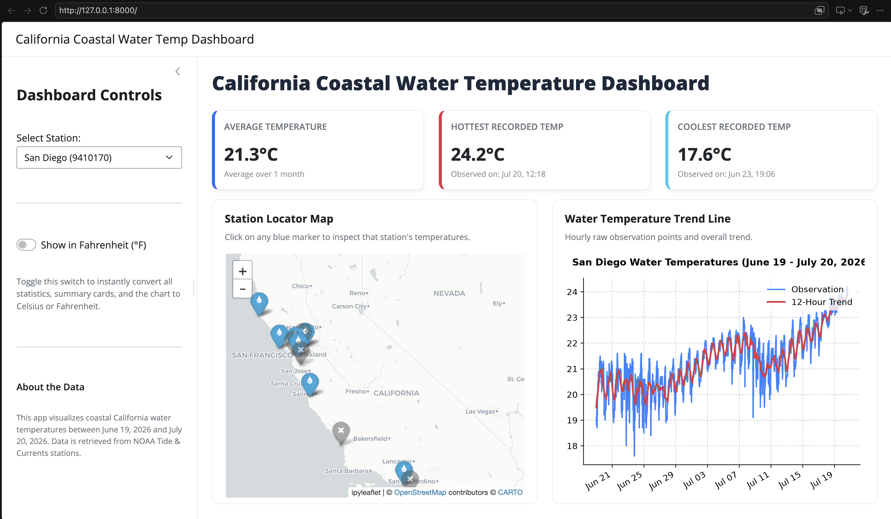

Generating web pages and data dashboards is one of the tasks LLM agents excel at, particularly when the data is already in hand and the architectural complexity is low. Because many analytical dashboards don't require complex backend servers, an LLM can easily package your data, interactive visual charts, and text explanations into a single, easily publishable web page.

## Prepare the required data and instructions

As usual, the first step is to set up the data and instructions for the agent to follow. In this example, we will use the data already prepared in [this repository](https://github.com/jairomelo/NOAA-water-temp-CA):

```bash
git clone https://github.com/jairomelo/NOAA-water-temp-CA.git
```

You can read the `README.md` file to understand the data and its structure, as well as the code used to download the data from NOAA.

To summarize, the data consists of water temperature measurements from multiple stations along the California coast, collected over several years. The data is stored in CSV files, with each file corresponding to a specific station and containing columns for date, temperature, and other relevant information.

Once we understand the data, we can decide what type of framework we want to use for our dashboard and what type of infrastructure we want to use for hosting it. In this example, we will use `Shiny` and `WebAssembly` to create an interactive dashboard that can be hosted on GitHub Pages. The main programming language (`R` or `Python`) will depend on your preference, unless you have a specific requirement for one of them. In this example, we will use `Python` and `Shiny` to create the dashboard.

Summary of the prerequisites for this example:

1. Data: Water temperature measurements from multiple stations along the California coast, stored in CSV files.
2. Framework: `Shiny` + `WebAssembly` for creating the interactive dashboard.
3. Hosting: GitHub Pages for hosting the dashboard.

:::{.callout-note icon=false collapse="true"}
### Do I need to prepare an AGENTS.md file for this task?

Not for this exercise. The agent will be able to handle the task without any additional instructions, as long as it has access to the data and knows what type of dashboard we want to create. However, if you want to customize the agent's behavior or add specific instructions for this task, you can create an `AGENTS.md` file and include it in the project.
:::

## Setting up the project in your workspace

### Set your credentials for GitHub in the workspace

Type this command in a separate terminal to set your credentials for GitHub in the workspace:

```bash
gh auth login
```

Follow the prompts to authenticate with your GitHub account. Select `https` to authenticate the GitHub CLI via the browser (or by pasting a personal access token), or `ssh` if you plan to use an SSH key for Git operations. After logging in, you can verify that you are authenticated by running:

```bash
gh auth status
```

### Prepare the destination repository

In GitHub, create a new, empty repository to host the dashboard. You can name it something like `water-temp-dashboard`. Do not initialize the repository with a README, `.gitignore`, or license file, as we will be pushing our local files to this repository later. Copy the URL of the repository, as we will need it later to push our local files to GitHub.

:::{.callout-tip icon=false collapse="true"}
### How to create your GitHub repository

The planning mode can be used to create a new GitHub repository. The agent will ask you for the name of the repository and will create it for you. You can also create the repository manually in GitHub by following these steps:

1. Go to [GitHub](https://github.com/) and log in to your account.
2. Click on the "+" icon in the top right corner and select "New repository".
3. Enter a name for your repository (e.g., `water-temp-dashboard`).
4. Choose "Public" to facilitate publication.
5. Do not initialize the repository with a README, `.gitignore`, or license file.
:::

## Planning the Dashboard

Let's instruct the agent on how to build the dashboard. We will provide specific and direct instructions to reduce ambiguity, particularly about data and the features we are requesting.

```text
You are an expert software architect. I need a plan to build a data dashboard.

I want to create a Shiny + WebAssembly dashboard to visualize water temperatures for California stations. The data is here: https://github.com/jairomelo/NOAA-water-temp-CA.

The data shape:
- Range: June 19, 2026 to July 20, 2026.
- Columns: StationID, StationName, Date_Time, Water_Temperature. (Ignore X, N, R columns).

Requirements:
- A dropdown to switch stations.
- A button to toggle Celsius/Fahrenheit.
- Summary cards: Avg Temp, Hottest Day, Coolest Day.
- An interactive map to select stations.

I want to publish this to my own GitHub profile using GitHub Pages via GitHub Actions. Use this empty, public, repository: [Include your repository URL].

Please provide the architectural plan, broken down into 3 distinct implementation phases. Do not write the full application code yet.
```

Choose the options that you want for the dashboard (e.g., which programming language you prefer to use, type of charts, etc.). 

Instruct the agent to make any desired changes to the plan. When you are satisfied with the plan, you can move to implementation.

## Instruct the agent to build the dashboard

Implementation can be done in phases, as outlined in the plan. You can just ask the agent to implement all phases at once, or you can ask it to implement each phase separately. Depending on the complexity of the dashboard, it may be easier to implement each phase separately and test it before moving on to the next phase.

For instance, for phase 1, you can use a prompt like this:

```text
Let's start with Phase 1.

Please write the code to implement only this first phase. Pay special attention to the data loading step—double-check your logic to ensure the data format and columns are retrieved and parsed correctly based on the repository.

Stop after completing Phase 1. Do not write the code for the subsequent phases yet so I can test this basic foundation first.
```

For phase 2, you can use a prompt like this:

```text
Let's move on to the next phase. Please provide the code to implement Phase 2 (Dashboard Implementation).

Focus on adding the interactive elements: the summary cards, the interactive map, and the main temperature chart. Ensure the reactive logic is fully working—when I change the station dropdown or toggle the Celsius/Fahrenheit button, all the visualizations and cards should update accordingly.

Please provide the updated, complete code for the application. Stop after Phase 2. Do not write the deployment/GitHub Actions code yet.
```

## Review and polish the dashboard

Before moving to the publication phase, you should review the dashboard and verify that it is working correctly. During development you’ll typically run it locally as a Shiny server; the WebAssembly/static GitHub Pages build comes later in the publication phase. To visually inspect the dashboard, open a new terminal window and run the following commands:

```bash
source .venv/bin/activate
shiny run --port 8080
```

You should see a message similar to this one:

```bash
Uvicorn running on http://127.0.0.1:8080 (Press CTRL+C to quit)
```

Look at the logs, and work with the agent to fix any issues that arise. You can also ask the agent to add additional features or polish the dashboard's appearance.

This step is usually the most time-consuming, as it may require multiple iterations to get the dashboard working correctly and looking good. However, once you are satisfied with the dashboard, you can move on to the publication phase.

Just for reference, this is what the final dashboard looks like in our case:



## Publish!

The next step involves publishing the dashboard to GitHub Pages. You can use GitHub Actions to automate the deployment process. The agent can help you set up the necessary workflow files and configurations to ensure that your dashboard is automatically deployed whenever you push changes to the repository.

A suggested prompt for this step is:

```text
Please implement phase 3 of the plan, including step-by-step instructions to configure GitHub to deploy the Dashboard via GitHub pages.
```

Depending on the previous configuration, the agent may ask you to provide your GitHub username and repository name, and possibly provide some instructions on how to set up GitHub Actions for automatic deployment.

It's very plausible that you will need to work with your agent to troubleshoot any issues that arise during the deployment process. This may involve checking the GitHub Actions logs, verifying that the workflow files are correctly configured, and ensuring that the dashboard is being deployed to the correct branch and directory.

