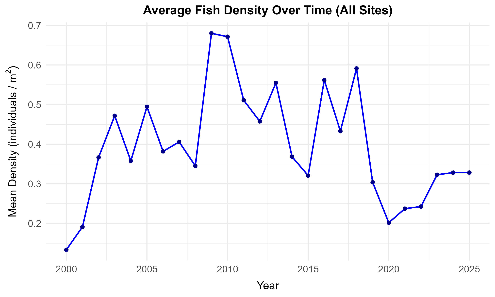
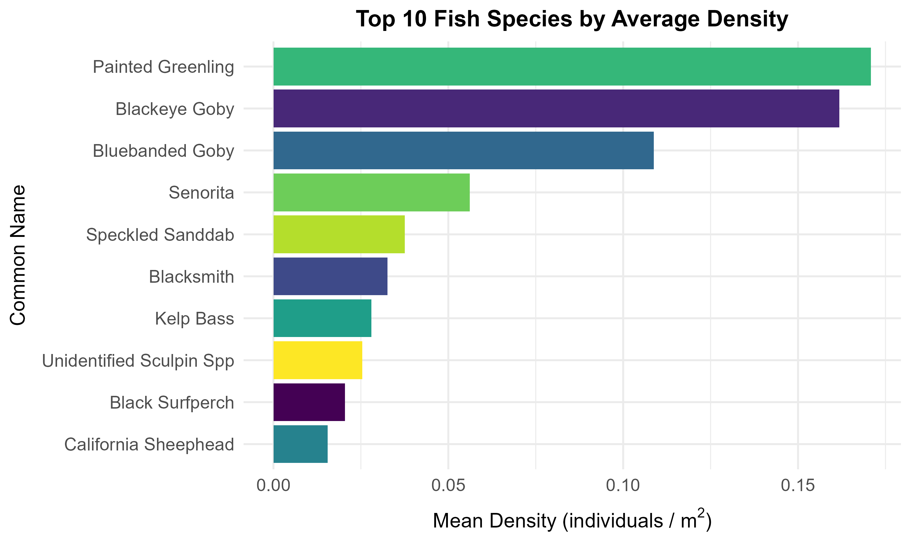
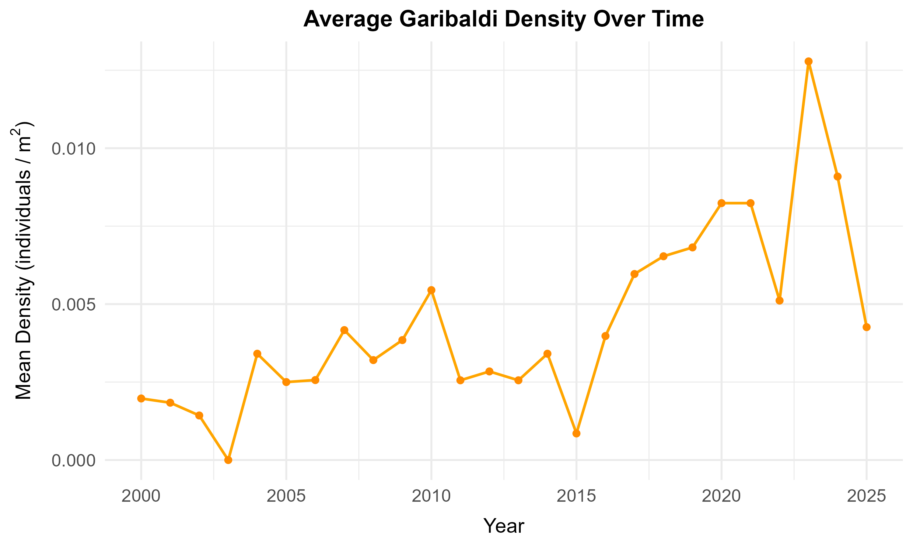

# Exploring Fish Abundance in the Kelp Forests of the Santa Barbara Channel

Understanding long-term ecological changes requires comprehensive and consistent monitoring. The Santa Barbara Coastal Long Term Ecological Research (SBC LTER) project investigates the processes structuring giant kelp forest ecosystems. As part of this effort, researchers have recorded the abundance and size of resident kelp forest fish at several reef sites since 2000. 

AI-assisted coding agent can help us construct scripts for downloading large dataset, cleaning missing or ambiguous values, and calculating an ecologically meaningful metric—**density** (individuals per unit area)—to explore questions such as: "How does the average fish density change over time?" and "Which species have the highest density across these reef ecosystems?"

### Workflow overview

1. Retrieve the Reef Fish Abundance data from the Santa Barbara Coastal Long Term Ecological Research (SBC LTER) data catalog.
2. Read and parse the dataset using programmatic tools (e.g., Python or R).
3. Clean the data by checking for NA values and handling domain-specific missing value indicators (e.g., `-99999`).
4. Calculate fish density at the transect level (Count / Area surveyed), and create visualizations showing time series density trends and species dominance.
5. Document your findings in a reproducible script and markdown report.

### Data and Setup

- **Data source:** We will use the SBC LTER dataset: [Reef: Kelp Forest Community Dynamics: Fish abundance (knb-lter-sbc.17)](https://sbclter.msi.ucsb.edu/data/catalog/package/?package=knb-lter-sbc.17). You can download the data directly using this [data download link](https://pasta.lternet.edu/package/data/eml/knb-lter-sbc/17/41/a7899f2e57ea29a240be2c00cce7a0d4) in case your agent falls to do so. 
- **Data storage and check:** Save the downloaded CSV data to your local directory (e.g., `data/annual_fish.csv`) to prevent repeated downloads of the ~20MB file. Ensure that the downloaded dataset is complete by verifying that the `YEAR` column spans from 2000 to 2025. If it is only a partial download, it is time to ask agent to double check its work.
- **AGENTS.md:** Create an `AGENTS.md` file to instruct your coding agent on project conventions, the dataset landing page, and visualization color palettes.

### Ask

#### Session 1: Data Ingestion and Cleaning

- Work with your agent in `plan` mode to generate a plan to conduct this data exploration research.
- Some brainstorming prompts for your agent:
  - What format does the SBC LTER use to represent missing or unrecorded data? *(Hint: The dataset uses `-99999` for missing values)*
  - What are the core columns we need to calculate density across years and species? *(Hint: `COUNT` and `AREA`)*
- Switch your agent to `build` mode to write a Python (or R) script to securely download the file, load it into a DataFrame, and filter out any rows where the `COUNT` or `AREA` columns are missing, `NA`, or listed as `-99999`.

#### Session 2: Research Questions

- Now let's explore the data further by following the research questions.

- **Visualizing Time Trends:** Instruct your agent to calculate the density of individuals. Ensure it groups the data to the transect level *first*, summing the total individuals on a transect, and dividing that sum by the `AREA` surveyed. Then, take the average density across all transects in a given year. Have it plot a line chart to show how the mean fish density (individuals per square meter) has fluctuated from 2000 to the present.

- **Identifying Dominant Species:** Instruct your agent to calculate the average density of each species (`COMMON_NAME` or `SCIENTIFIC_NAME`) across all surveyed transects. Identify the top 10 species with the highest average density across all years and sites. Present this as a horizontal bar chart.

- **Focus on a Species of Interest:** The **Garibaldi** (*Hypsypops rubicundus*) is the official marine state fish of California. Instruct your agent to filter the transect-level data for just the Garibaldi and plot its average density over time to see if the state fish's population is stable.

### Going further

- Can you break down the yearly mean density by specific sites (e.g., `NAPL` vs. `MOHK`) using a multi-line chart or faceted plot?
- Are certain species more densely populated in certain geographic areas? Consider creating a heatmap of average species density vs. site codes.
- The `NAPL` and `IVEE` sites are Marine Protected Areas (MPAs). Do they have a higher fish density than the other sites?
- How does the `SIZE` distribution of a specific prominent species (like "Blacksmith") look, and has that average size changed over the last two decades?

### References

- Reed, D, R. Miller. 2025. SBC LTER: Reef: Kelp Forest Community Dynamics: Fish abundance ver 41. Environmental Data Initiative. https://doi.org/10.6073/pasta/73cb2666f95f7a4a4c2e3744f1bb5e0e