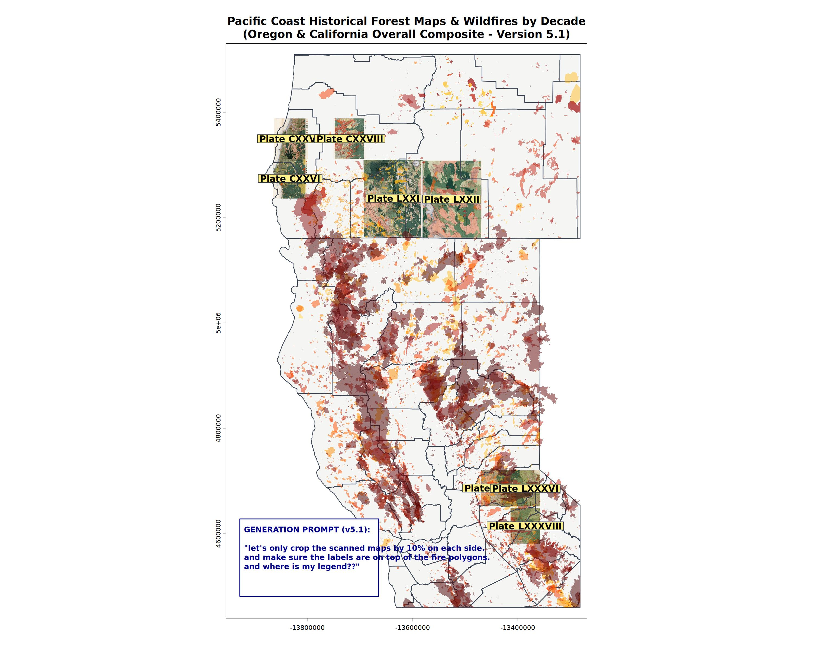
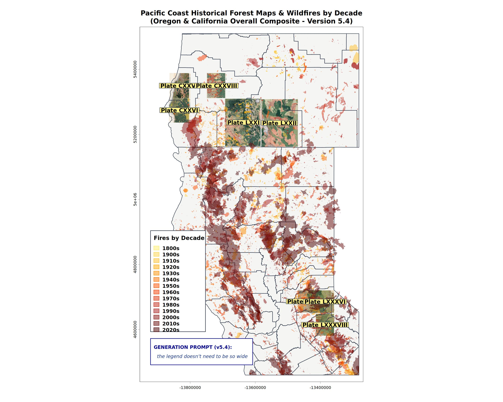

## Use case: Exploring Geodata

A common GIS task is to download some data and output maps to make sure the data is relevant to a task at hand. Using RStudio or Positron, this could take many lines of code as preliminary individual visualizations are made, ranges of data values explored, metadata examined. 

Using a coding agent, especially one tuned to a `geoAgents.md` file, can make this a 10-minute exercise.

## Plot, summarize, report

While these three steps represent common outputs of such an exploratory analysis, there are always intermediate steps that vary from project to project. Here is where the AI coding agent shines.

The intermediate process often looks like this:

1. Run commands to learn what the format of the data
1. Load data into  appropriate objects
1. Plot each piece of data to visually confirm its relevance and geographic extent
1. Reproject, re-sample, and / or crop data to a usable size and relevant extent.
1. Overlay the data in a logical order so that each layer is visible.

## What this looks like in real life

Often a geospatial project starts off with a vague curiosity spotted on a map. 

In in its annual report from 1901, the US Forest Service, as it did at the time of heavy timber extraction, published a series of maps showing marketable timber in the 4 areas of the Pacific Northwest. Two of the symbols used on the map show "Recently burned, restocking" and "Recenly burned, not restocking." The burn areas mapped are larger than most contemporary catastrophic wildfires, which sparked curiosity. Were there really such large 19th century wildfires? Were these evidence of slash-and-burn settler practices? Earlier Native cultural landscape management burns? 

R scripts and varioud outputs created using OpenCode are in this repository: [r-geo-viz](https://github.com/UCSBCarpentry/r-geo-viz)

To answer this question, one would traditionally follow these steps:

1. Find a scanned version of the historic map
1. Georeference the map to real world coordinates (ie: turn it into data)
1. Find the best long-term fire record for the area
1. Overlay the two and hope for the best.
1. Fail. Downsample the scanned maps. Reproject the vector data. Filter the vector data to just the oldest fires. Realize that any fire labelled 1900 is a default 'we don't know, but it was before 1900, which is when we started keeping annual records.'

Iterating with the coding agent, I was able to generate acceptable output to explain the fire story (in my mind at least) using R. It was slower than using a graphical GIS, but way, way faster than if I had attempted to explore the data with R.

## Agentic gotchas

The key to success is to not trust the AI to find the correct data. In this case, the state of Oregon keeps a vector file of 'historic wildfire extents.' Historic in this case means before 1980. Inexperienced researchers and the AI get thrown off by this. Using the term 'paleofire' would not have helped in this example, as this almost always is lake core sediment or tree ring data that are proxies for fires, and rarely point towards the extents of individual fire events.

In this project, the human's background knowledge of fire regimes is key to scoping the problem.
