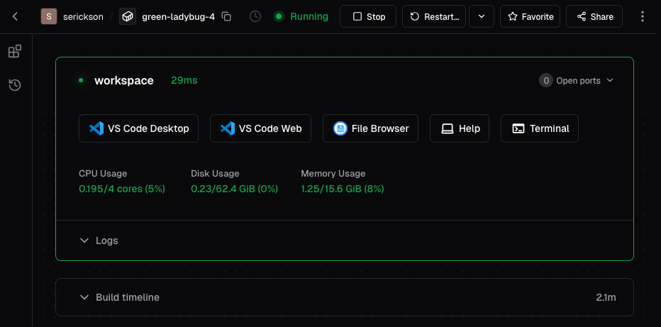

Please complete the following before you arrive on the first day of the workshop.

## Create Your Workspace

For the workshop, we will use a coding agent installed in a virtual machine that
you access remotely (a [Coder Workspace](https://coder.dreamlab.ucsb.edu)). You will be using VSCode in a browser window. It
can take a few minutes to create your workspace so we recommend doing it before
the workshop. 

Follow these steps to create your workspace:

1. Log in to our [Coder Workspace Environment](https://coder.dreamlab.ucsb.edu) using your UCSB NetID.
2. Click the **New Workspace** button and then **Coder Workspace (Summer
   2026)**.
3. On the New Workspace form:
   - Enter a **name** for your workspace (or use the suggested name)
   - Review the usage policies and click "**I understand the usage policies**".
   - Click **Yes** for "Include Visual Studio Code (Web)"
   - (**Optional, see below**) Click **Yes** for "Include Visual Studio Code (Desktop)"
   - Click the **Create Workspace** button
   - It will take a few minutes for the workspace to be created.

It may take a few minutes for the workspace to start up. Once it does, you
should see a workspace dashboard. Your dashboard controls may be slightly
different, depending on the options you enabled.

{fig-alt="Example Coder Workspace dashboard with buttons to stop and restart the workspace, and open VS Code"}

## Optional Setup for VS Code Desktop

If you prefer to use the VS Code desktop app, rather than the browser-based
version, use these instructions to set things up.

### Install VS Code

We will use Visual Studio Code ([VS Code](https://code.visualstudio.com/)) as
our primary development environment. Download and install VS Code using [these
instructions](https://code.visualstudio.com/docs/getstarted/overview#_install-vs-code).

### Install Coder Remote Extension for VS Code

We will use the [Coder
Remote](https://marketplace.visualstudio.com/items?itemName=coder.coder-remote)
extension for VS Code to connect to our Coder Workspace from inside VS Code.

To install, click the green "Install" button on that page. (You should already
have VS Code installed). Alternatively, you can install it through the
"Extensions" panel within VS Code: search for "Coder Remote" and click
"install". 

### Check That Everything Works

Check that you can connect to your Coder Workspace from VS Code.

- Open VS Code and click the Coder extension icon from the vertical bar on the
  left side of the menu. You should see a button to "Login"
- Click the login button and enter `https://coder.dreamlab.ucsb.edu` in the text
  input box. Then press Enter.
- Your web browser should open to a page with a button to "copy session token."
  Click the "copy session token" button and close the browser window/tab.
- Back in VS Code, paste the session token in the "Coder API Key" text input and
  press Enter. 
- You should see the workspace you created listed in the "My Workspaces" panel of
  the Coder Remote extension.
